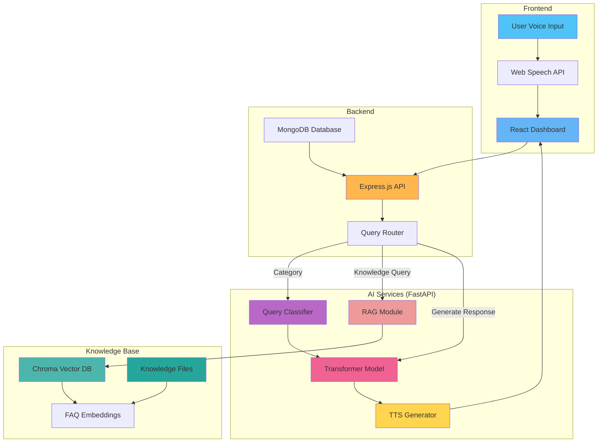

# 🧠 TRAVIS - AI-Powered Assistant for Visually Impaired Service Agents

<div align="center">

[](https://opensource.org/licenses/MIT)
[](https://python.org)
[](https://reactjs.org)
[](https://nodejs.org)
[](https://www.docker.com)

TRAVIS is a **voice-driven, AI-powered banking assistant** designed to empower visually impaired bank agents. It processes spoken queries, classifies them into relevant banking categories using transformer models, retrieves customer data when needed, and augments responses with knowledge base information—providing an **accessible interface with voice and visual support**.

</div>

---

## 🚀 Key Features

### 🎙️ **Voice Interaction**
- **Speech-to-Text**: Uses **Web Speech API** for converting voice input into text.
- **Text-to-Speech (TTS)**: Provides voice responses for seamless communication.
- **Auto-Read Mode**: Toggleable feature to read responses aloud automatically.

### 🧠 **AI-Powered Query Handling**
- **Query Classification**: Uses a transformer-based model for accurate banking category identification.
- **Multi-Mode Response System**:
  - **AI Mode (Transformer)**: Generates dynamic responses based on a custom PyTorch seq2seq model.
  - **Database Mode**: Fetches account-related details for queries requiring authentication.
  - **Knowledge Base Mode (RAG)**: Retrieves answers from a curated FAQ knowledge base using semantic search.

### 📚 **RAG (Retrieval-Augmented Generation) Knowledge Base**
The Knowledge Base module provides intelligent document retrieval and FAQ management:

#### **Core RAG Features:**
- **Semantic Search**: Uses **Sentence Transformers** (all-MiniLM-L6-v2) to convert text to embeddings
- **Vector Database**: **Chroma** stores and efficiently retrieves FAQ embeddings
- **Intelligent Retrieval**: Finds the most relevant FAQ answers based on semantic similarity
- **Fallback Support**: Seamlessly switches to AI mode when knowledge base lacks an answer
- **Extensible FAQs**: Easy to add new banking FAQs to the knowledge base

#### **Knowledge Base Coverage:**
- 💳 Credit cards & debit cards
- 🏦 Account management & activation
- 💰 Loan & credit services
- 💸 Payment methods & transfers (UPI, NEFT, RTGS)
- 🔄 Card replacement & blocking
- 📋 KYC & document requirements
- 🔐 Security & fraud protection

#### **How RAG Works:**
1. User asks: *"What should I do if I lost my credit card?"*
2. System converts question to embedding using Sentence Transformers
3. Chroma retrieves top matching FAQs from vector database
4. Returns relevant answer with high confidence
5. If no match found, AI mode generates dynamic response

### 🔁 **Banking Services Covered**
- 💰 **Balance Inquiry**
- 📄 **Account Statement**
- 📌 **KYC Status**
- 🏦 **Loan Approval & Status**
- 📚 **FAQ Knowledge Base Search**
- 🌐 **Multi-language Support** (English & Telugu)

### 👤 **Agent & Admin Dashboard**
- **Agent Profile**: Accessible dashboard for visually impaired bank agents
- **Admin Panel**: Complete customer management with CRUD operations
- **Query History**: Track previous queries and responses

### ♿ **Accessibility Enhancements**
- **Adjustable Font Sizes**: Scale UI text to user preference
- **High-Contrast Dark Mode**: Optimized for visually impaired users
- **Voice Response Toggle**: Enable/disable automatic audio feedback
- **Query Mode Selection**: Easy switching between AI, Database, and Knowledge Base modes

---

## 🛠 Technology Stack

<div align="center">

| **Layer** | **Technology** | **Purpose** |
|-----------|----------------|-----------|
| **Frontend** | React 18+, JavaScript, Web Speech API | User interface & voice I/O |
| **Backend API** | Node.js, Express.js | API routing & business logic |
| **Database** | MongoDB | Customer & query history storage |
| **AI & NLP** | Python 3.11, FastAPI, PyTorch 2.1.2 | Model inference & processing |
| **RAG System** | Sentence Transformers, Chroma DB | Knowledge base & semantic search |
| **Text-to-Speech** | gTTS (Google TTS) | Voice response generation |
| **Containerization** | Docker, Docker Compose | Service orchestration |

</div>

---

## 📦 Installation & Setup

### � **Option 1: Docker (Recommended for Production)**

#### Prerequisites
- **Docker** and **Docker Compose** installed
- **MongoDB** running on `localhost:27017`
- **4GB+ RAM** available for AI models

#### Step 1: Clone Repository
```bash
git clone https://github.com/AmshudharReddy/TRAVIS.git
cd TRAVIS
```

#### Step 2: Build All Docker Images
```bash
# Build all services
docker compose build

# Or build individually:
docker build -t travis-ai ./ai_services          # AI Services (Python)
docker build -t travis-be ./backend              # Backend (Node.js)
docker build -t travis-fe ./frontend             # Frontend (React)
```

#### Step 3: Run Services with Docker Compose
```bash
# Start all services in background
docker compose up -d

# View running containers
docker compose ps

# Check logs (all services)
docker compose logs -f

# Check logs for specific service
docker compose logs -f travis-ai-services
docker compose logs -f travis-backend
docker compose logs -f travis-frontend
```

**Access the application:**
- **Frontend**: http://localhost:3000
- **Backend API**: http://localhost:5000
- **AI Services**: http://localhost:5001

#### Step 4: Stop Services
```bash
# Stop all services
docker compose down

# Stop and remove volumes (clears cache)
docker compose down -v
```

---

### 🎯 **Run Individual Docker Containers (Without Compose)**

If you prefer to run each service separately:

#### AI Services (Port 5001)
```bash
docker run -d \
  --name travis-ai-services \
  -p 5001:5001 \
  -v "$(pwd)/knowledge_base:/knowledge_base:ro" \
  -v hf_cache:/app/.cache/huggingface \
  -v st_cache:/app/.cache/sentence_transformers \
  -e PYTHONUNBUFFERED=1 \
  -e HF_HOME=/app/.cache/huggingface \
  -e TRANSFORMERS_CACHE=/app/.cache/huggingface \
  -e SENTENCE_TRANSFORMERS_HOME=/app/.cache/sentence_transformers \
  -m 3g \
  travis-ai
```

#### Backend (Port 5000)
```bash
docker run -d \
  --name travis-backend \
  -p 5000:5000 \
  -e NODE_ENV=production \
  -e AI_BASE_URL=http://host.docker.internal:5001 \
  -e MONGO_URI=mongodb://host.docker.internal:27017/TRAVIS \
  --add-host host.docker.internal:host-gateway \
  travis-be
```

#### Frontend (Port 3000)
```bash
docker run -d \
  --name travis-frontend \
  -p 3000:3000 \
  travis-fe
```

#### Stop All Individual Containers
```bash
docker stop travis-ai-services travis-backend travis-frontend
docker rm travis-ai-services travis-backend travis-frontend
```

---

### 💻 **Option 2: Manual Setup for Development**

#### Prerequisites
- **Node.js** 16+ (for Frontend & Backend)
- **Python** 3.10+ (for AI Services)
- **MongoDB** running locally

#### Step 1: Clone Repository
```bash
git clone https://github.com/AmshudharReddy/TRAVIS.git
cd TRAVIS
```

#### Step 2: Setup Frontend
```bash
cd frontend
npm install
npm audit fix  # Fix any vulnerabilities
```

#### Step 3: Setup Backend
```bash
cd ../backend
npm install
```

#### Step 4: Setup AI Services
```bash
cd ../ai_services

# Create virtual environment
python -m venv venv

# Activate virtual environment
# On Windows:
venv\Scripts\activate
# On macOS/Linux:
source venv/bin/activate

# Install dependencies (with specific PyTorch version)
pip install torch==2.1.2 torchvision==0.16.2 torchaudio==2.1.2 --index-url https://download.pytorch.org/whl/cpu
pip install -r requirements.txt

# Download spaCy model
python -m spacy download en_core_web_sm
```

---

### 🐍 **Python Dependencies (AI Services)**

```txt
# Core AI Framework
fastapi==0.109.2
uvicorn[standard]==0.27.1

# Deep Learning
torch==2.1.2
torchvision==0.16.2
torchaudio==2.1.2

# NLP & Transformers
transformers==4.35.2
tokenizers==0.15.2
huggingface_hub==0.19.4

# RAG Components
sentence-transformers==2.7.0    # Semantic embeddings
chromadb==0.4.24                # Vector database

# Additional Libraries
scikit-learn==1.6.1             # ML utilities
spacy==3.7.4                    # NLP processing
nltk==3.8.1                     # Text processing
gTTS==2.5.1                     # Text-to-Speech
regex==2023.12.25
```


## ▶️ Running the Application

### � With Docker Compose (Recommended)
```bash
# Build images (first time)
docker compose build

# Start all services
docker compose up -d

# View logs
docker compose logs -f

# Stop services
docker compose down
```

### 🖥️ Development Mode (Manual - Three Separate Terminals)

<div align="center">

| **Service** | **Directory** | **Command** | **URL** |
| ----------- | ------------- | ----------- | ------- |
| 🎨 **Frontend** | `./frontend` | `npm start` | `http://localhost:3000` |
| 🔧 **Backend** | `./backend` | `node index.js` | `http://localhost:5000` |
| 🤖 **AI Services** | `./ai_services` | `python main.py` | `http://localhost:5001` |

</div>

---

## 🔌 API Endpoints

### 📥 **Query Request Format:**
```json
{
  "query": "What should I do if I lost my credit card?",
  "mode": "knowledge"
}
```

### 📤 **Response Examples:**

#### 1️⃣ **Category Classification:**
*Encoder-only Transformer model classifies query into banking categories.*
```json
{
  "category": "card_replacement_blocking",
  "confidence": 0.95
}
```

#### 2️⃣ **Knowledge Base Response (RAG):**
*Retrieved from FAQ database using semantic similarity.*
```json
{
  "mode": "knowledge",
  "response": "If you lost your credit card, immediately call our customer service to block it. You can request a replacement card which will be delivered in 7-10 business days.",
  "source": "FAQ_CARD_REPLACEMENT"
}
```

#### 3️⃣ **AI Generated Response:**
*Encoder-Decoder Transformer generates dynamic response.*
```json
{
  "mode": "ai",
  "response": "If you have lost your credit card, please immediately contact our customer service team to block the card and prevent unauthorized usage. A new card will be issued to you within 7-10 business days."
}
```

#### 4️⃣ **Translation Response:**
*Translates response to Telugu.*
```json
{
  "original": "If you lost your credit card...",
  "translation": "మీరు మీ క్రెడిట్ కార్డ్ కోల్పోతే..."
}
```

---

## 🏗️ Architecture


---

## 📸 Screenshots

<div align="center">

### 🖥️ **Agent Dashboard UI**


### 💬 **Response Display UI**


### 🔄 **Input-Output Workflow**


### 🌙 **Dark Mode & Accessibility Features**


</div>

---
## 🛣️ Roadmap

### 🎯 Version 2.0 Goals

- [ ] **Multi-language Voice Support** - Additional regional languages
- [ ] **Advanced Analytics Dashboard** - Usage insights and reporting
- [ ] **Mobile Application** - Native iOS and Android apps
- [ ] **Biometric Authentication** - Voice pattern recognition
- [ ] **Real-time Notifications** - Account alerts and updates
- [ ] **Enhanced AI model accuracy**
- [ ] **Improved accessibility features**
- [ ] **Advanced security measures**
- [ ] **Performance optimizations**

---

## 🚨 Troubleshooting

### Common Issues & Solutions

#### ❌ **Voice Recognition Not Working**
```
Issue: Microphone not detected or Web Speech API unavailable
Solution:
  1. Check browser compatibility (Chrome/Edge recommended)
  2. Grant microphone permissions to the browser
  3. Test microphone with system sound settings
  4. Try in incognito mode
```

#### ❌ **AI Service Connection Failed**
```
Issue: Backend cannot connect to AI service on port 5001
Solution:
  1. Verify AI service is running: docker compose logs travis-ai-services
  2. Check if port 5001 is available: netstat -an | grep 5001
  3. Confirm Hugging Face models are cached (first run takes 10-15 mins)
  4. Check available RAM and disk space
```

#### ❌ **Knowledge Base Queries Failing**
```
Issue: RAG module not returning results
Solution:
  1. Verify knowledge_base folder exists: ls knowledge_base/
  2. Check Chroma database: docker exec travis-ai-services ls /knowledge_base/chroma_store/
  3. Check Sentence Transformers cache is populated
  4. Review logs for embedding errors: docker compose logs travis-ai-services | grep -i rag
```

#### ❌ **Database Connection Issues**
```
Issue: MongoDB connection timeout
Solution:
  1. Verify MongoDB is running on localhost:27017
  2. Check connection string in docker-compose.yml
  3. Test connection: mongo mongodb://localhost:27017/TRAVIS
  4. For Docker: Use correct host gateway flag
```

#### ❌ **Docker Permission Denied Errors**
```
Issue: Permission denied when accessing cache volumes
Solution:
  1. Run containers with proper user permissions
  2. Clear and rebuild volumes: docker compose down -v && docker compose up -d --build
  3. Check file ownership in docker volumes
```

#### ⚠️ **Slow First Requests (AI Service)**
```
This is normal! First request downloads models:
  - Sentence Transformers: ~90MB
  - Transformers library: ~300MB+
  - Total: 15-30 minutes on first run
  
Solution: Pre-warm cache with: docker exec travis-ai-services python -c "from sentence_transformers import SentenceTransformer; SentenceTransformer('all-MiniLM-L6-v2')"
```

---

## 📜 License
**MIT License** – See `LICENSE` file for details.

## 📌 Acknowledgements

We extend our gratitude to the following technologies and communities:

<div align="center">

| Technology | Purpose | Links |
|------------|---------|-------|
|  | Deep Learning Framework | [pytorch.org](https://pytorch.org) |
|  | Modern Python API Framework | [fastapi.tiangolo.com](https://fastapi.tiangolo.com) |
|  | Frontend Library | [reactjs.org](https://reactjs.org) |
|  | Document Database | [mongodb.com](https://mongodb.com) |
| **Web Speech API** | Browser Speech Recognition | [MDN Docs](https://developer.mozilla.org/en-US/docs/Web/API/Web_Speech_API) |
| **gTTS** | Google Text-to-Speech | [PyPI](https://pypi.org/project/gTTS/) |

</div>

## 🤝 Contributing

We appreciate contributions via pull requests. For major changes, please open an issue first so we can have a quick discussion about your plans.

---

## 🙋‍♂️ Author

<div align="center">

**Amshudhar A. & Team**  
*Building accessible, intelligent tools for real-world impact.*

[](https://github.com/AmshudharReddy)

</div>

---

<div align="center">

### 🌟 If TRAVIS helped you, please consider giving it a star!

[](https://github.com/AmshudharReddy/TRAVIS)

**Made with ❤️ for accessibility and inclusion**

</div>
