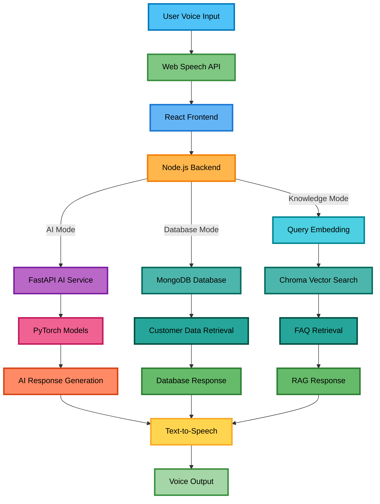

# 🧠 TRAVIS — AI-Powered Assistant for Bank Service Agents

<div align="center">

[](https://opensource.org/licenses/MIT)
[](https://python.org)
[](https://reactjs.org)
[](https://nodejs.org)
[](https://www.docker.com)

**TRAVIS** is a voice-driven, AI-powered banking assistant designed to empower bank agents. It processes spoken queries, classifies them using transformer models, retrieves customer data when needed, and augments responses with knowledge base information — providing an accessible interface with full voice and visual support.

</div>

<div align="center">

[Getting Started](#-getting-started) • [Features](#-features) • [Tech Stack](#-tech-stack) • [API Reference](#-api-reference) • [Architecture](#-architecture) • [Screenshots](#-screenshots) • [Roadmap](#-roadmap) • [Troubleshooting](#-troubleshooting)

</div>

---

## 🚀 Getting Started

Choose the setup method that fits your situation:

| Method | Best for | Difficulty | Estimated time |
|---|---|---|---|
| 🐳 [Docker Compose](#-option-1-docker-compose-recommended) | Production, quick local setup | ⭐ Easy | ~5 min |
| 📦 [Individual Containers](#-option-2-individual-docker-containers) | Testing individual services | ⭐⭐ Medium | ~10 min |
| 💻 [Manual — No Docker](#-option-3-manual-setup-no-docker) | Development & debugging | ⭐⭐⭐ Hard | ~20 min |

> **New here?** Start with Docker Compose — it handles everything automatically.

---

### 🐳 Option 1: Docker Compose (Recommended)

#### Prerequisites

- [Docker Desktop](https://www.docker.com/products/docker-desktop) installed and running
- 4 GB+ RAM available
- Git installed

#### Step 1 — Clone the repository

```bash
git clone https://github.com/AmshudharReddy/TRAVIS.git
cd TRAVIS
```

#### Step 2 — Configure environment variables

```bash
# Copy the example file
cp .env.example .env

# On Windows:
notepad .env

# On macOS/Linux:
nano .env
```

>  The `.env.example` file at the project root documents every variable with comments. Two values matter most for Docker Compose:
>
> - `AI_BASE_URL=http://ai_services:5001` — keep exactly as-is; `ai_services` is the Docker Compose internal service name
> - `REACT_APP_API_URL=http://localhost:5000` — must be a URL your **browser** can reach, so use `localhost` not the Docker service name

#### Step 3 — Build images

```bash
docker compose build
# Builds: travis-ai-services, travis-backend, travis-frontend
```

#### Step 4 — Start services

```bash
docker compose up -d
```

> ⏳ On the first run, the AI service downloads ~400 MB of models. This takes 15–30 minutes. Check progress with:
> ```bash
> docker compose logs -f travis-ai-services
> # Wait until you see: "Application startup complete"
> ```

#### Step 5 — Open the application

| Service | URL |
|---|---|
| Frontend | http://localhost:3000 |
| Backend API | http://localhost:5000 |
| AI Services | http://localhost:5001 |

#### Step 6 — Stop services

```bash
# Stop and keep data
docker compose down

# Stop and clear all cached volumes (forces model re-download)
docker compose down -v
```

#### Useful commands

```bash
# Follow logs for all services
docker compose logs -f

# Follow logs for a specific service
docker compose logs -f travis-backend
docker compose logs -f travis-ai-services
docker compose logs -f travis-frontend

# Restart a specific service
docker compose restart travis-backend

# Check resource usage
docker stats

# Run a command inside a running container
docker compose exec travis-backend node --version
```

---

### 📦 Option 2: Individual Docker Containers

Use this when you want to run or test services independently without Docker Compose.

#### Prerequisites

- Docker installed
- MongoDB running locally on `localhost:27017`
- 4 GB+ RAM
- Git installed

#### Step 1 — Clone and build images

```bash
git clone https://github.com/AmshudharReddy/TRAVIS.git
cd TRAVIS

# Create your .env from the example and update these two values for individual containers:
#   MONGO_URI=mongodb://host.docker.internal:27017/TRAVIS
#   AI_BASE_URL=http://host.docker.internal:5001
cp .env.example .env
```

```powershell
# PowerShell (Windows)
docker build -t travis-ai ./ai_services
docker build -t travis-be ./backend
$url = (Get-Content .env | Select-String "REACT_APP_API_URL").ToString().Split("=",2)[1]
docker build -t travis-fe --build-arg REACT_APP_API_URL=$url ./frontend
```

```bash
# macOS/Linux
docker build -t travis-ai ./ai_services
docker build -t travis-be ./backend
docker build -t travis-fe \
  --build-arg REACT_APP_API_URL=$(grep REACT_APP_API_URL .env | cut -d '=' -f2) \
  ./frontend
```

#### Step 2 — Run AI Services (port 5001)

```powershell
# PowerShell (Windows)
docker run -d `
  --name travis-ai-services `
  -p 5001:5001 `
  -v "${PWD}/knowledge_base:/knowledge_base:ro" `
  -v hf_cache:/app/.cache/huggingface `
  -v st_cache:/app/.cache/sentence_transformers `
  -e PYTHONUNBUFFERED=1 `
  -m 3g `
  travis-ai
```

```bash
# macOS/Linux
docker run -d \
  --name travis-ai-services \
  -p 5001:5001 \
  -v "$(pwd)/knowledge_base:/knowledge_base:ro" \
  -v hf_cache:/app/.cache/huggingface \
  -v st_cache:/app/.cache/sentence_transformers \
  -e PYTHONUNBUFFERED=1 \
  -m 3g \
  travis-ai
```

Wait for the service to be ready before proceeding:

```bash
docker logs -f travis-ai-services
# Ready when you see: "Application startup complete"
```

#### Step 3 — Run Backend (port 5000)

```powershell
# PowerShell (Windows)
docker run -d `
  --name travis-backend `
  -p 5000:5000 `
  --env-file .env `
  --add-host host.docker.internal:host-gateway `
  travis-be
```

```bash
# macOS/Linux
docker run -d \
  --name travis-backend \
  -p 5000:5000 \
  --env-file .env \
  --add-host host.docker.internal:host-gateway \
  travis-be
```

#### Step 4 — Run Frontend (port 3000)

```powershell
# PowerShell (Windows)
docker run -d `
  --name travis-frontend `
  -p 3000:3000 `
  travis-fe
```

```bash
# macOS/Linux
docker run -d \
  --name travis-frontend \
  -p 3000:3000 \
  travis-fe
```

#### Step 5 — Open the application

| Service | URL |
|---|---|
| Frontend | http://localhost:3000 |
| Backend API | http://localhost:5000 |
| AI Services | http://localhost:5001 |

#### Step 6 — Stop and clean up

```bash
# Stop containers
docker stop travis-ai-services travis-backend travis-frontend

# Remove containers
docker rm travis-ai-services travis-backend travis-frontend

# Remove images (optional)
docker rmi travis-ai travis-be travis-fe
```

#### Useful commands

```bash
# Follow logs for a container
docker logs -f travis-backend

# Check all container statuses
docker ps -a

# Inspect an environment variable
docker exec travis-backend printenv MONGO_URI

# Check per-container resource usage
docker stats travis-backend
```

---

### 💻 Option 3: Manual Setup (No Docker)

Run each service natively on your machine — useful for development and debugging.

#### Prerequisites

| Requirement | Version | Download |
|---|---|---|
| Node.js | 16+ | [nodejs.org](https://nodejs.org) |
| Python | 3.10+ | [python.org](https://python.org) |
| MongoDB | 5.0+ | [MongoDB Community](https://www.mongodb.com/try/download/community) or Atlas |
| Git | any | — |

#### Step 1 — Clone the repository

```bash
git clone https://github.com/AmshudharReddy/TRAVIS.git
cd TRAVIS
```

#### Step 2 — Start MongoDB

```bash
# Windows — starts automatically if installed as a service, or:
mongod

# macOS (Homebrew):
brew services start mongodb-community

# Linux:
sudo systemctl start mongod

# Verify it's running:
mongosh mongodb://localhost:27017/TRAVIS
```

#### Step 3 — Start AI Services (Terminal 1)

```bash
cd ai_services

# Create and activate a virtual environment
python -m venv venv

# macOS/Linux:
source venv/bin/activate
# Windows:
venv\Scripts\activate

# Install PyTorch (CPU build)
pip install torch==2.1.2 torchvision==0.16.2 torchaudio==2.1.2 \
  --index-url https://download.pytorch.org/whl/cpu

# Install remaining dependencies
pip install -r requirements.txt

# Download spaCy model
python -m spacy download en_core_web_sm

# Start the AI service
python main.py
# Runs at: http://localhost:5001
```

> ⏳ The first run downloads Hugging Face models (~400 MB). Subsequent starts are fast.

#### Step 4 — Start Backend (Terminal 2)

```bash
cd backend
npm install
node index.js
# Runs at: http://localhost:5000
```

#### Step 5 — Start Frontend (Terminal 3)

```bash
cd frontend
npm install
npm audit fix   # optional — resolves known vulnerabilities
npm start
# Runs at: http://localhost:3000
```

#### Step 6 — Open the application

All three services must be running before the app works end-to-end.

| Service | URL |
|---|---|
| Frontend | http://localhost:3000 |
| Backend API | http://localhost:5000 |
| AI Services | http://localhost:5001 |

Press `Ctrl+C` in each terminal to stop a service.

---

## ✨ Features

### 🎙️ Voice Interaction

- **Speech-to-Text** — Web Speech API converts voice input to text in real time
- **Text-to-Speech (TTS)** — Spoken responses for seamless, eyes-free communication
- **Auto-Read Mode** — Toggleable automatic readback of every response

### 🧠 AI-Powered Query Handling

Voice queries are first passed through an **encoder-only transformer** (intent classifier) that identifies the banking category and routes the query to the appropriate response mode. There are three modes:

#### 🗄️ Database Mode

Handles queries that require live account data. The backend authenticates the request, queries MongoDB, retrieves the relevant customer record, and returns a structured response.

#### 🤖 Neural AI Mode

For open-ended or dynamic queries, an **encoder-decoder transformer** (seq2seq model built with PyTorch) generates a natural language response. The encoder processes the classified query context; the decoder produces a relevant banking answer token by token.

#### 📚 Knowledge Mode — RAG

For FAQ-style queries, TRAVIS uses Retrieval-Augmented Generation (RAG) to find the most semantically relevant answer from a curated knowledge base.

| Component | Technology |
|---|---|
| Embeddings | Sentence Transformers (`all-MiniLM-L6-v2`) |
| Vector Store | Chroma DB |
| Retrieval | Cosine similarity over FAQ embeddings |
| Fallback | Automatically falls back to Neural AI mode when no match is found |

**Knowledge base coverage:**

- 💳 Credit cards & debit cards
- 🏦 Account management & activation
- 💰 Loans & credit services
- 💸 Payments & transfers (UPI, NEFT, RTGS)
- 🔄 Card replacement & blocking
- 📋 KYC & document requirements
- 🔐 Security & fraud protection

**How RAG works — example flow:**

1. Agent asks: *"What should I do if I lost my credit card?"*
2. Query is converted to a vector embedding using Sentence Transformers
3. Chroma searches the FAQ vector store using cosine similarity
4. The most relevant FAQ answer is returned with a confidence score
5. If no match meets the threshold, Neural AI mode generates a dynamic response

---

### 🔁 Banking Services Covered

- 💰 Balance Inquiry
- 📄 Account Statement
- 📌 KYC Status
- 🏦 Loan Approval & Status
- 📚 FAQ Knowledge Base Search
- 🌐 Multi-language Support (English & Telugu)

### 👤 Agent & Admin Dashboard

- **Agent Profile** — Accessible dashboard optimised for service agents
- **Admin Panel** — Full customer management with CRUD operations
- **Query History** — Track previous queries and their responses

### ♿ Accessibility Features

- Adjustable font sizes
- High-contrast dark mode
- Voice response toggle
- Easy query mode switching (AI / Database / Knowledge Base)

---

## 🛠️ Tech Stack

| Layer | Technology | Purpose |
|---|---|---|
| **Frontend** | React 18+, JavaScript, Web Speech API | UI & voice I/O |
| **Backend API** | Node.js, Express.js | API routing & business logic |
| **Database** | MongoDB | Customer data & query history |
| **AI & NLP** | Python 3.11, FastAPI, PyTorch 2.1.2 | Model inference & processing |
| **RAG System** | Sentence Transformers, Chroma DB | Knowledge base & semantic search |
| **Text-to-Speech** | gTTS (Google TTS) | Voice response generation |
| **Containerisation** | Docker, Docker Compose | Service orchestration |

---

## 🔌 API Reference

### Query request format

```json
{
  "query": "What should I do if I lost my credit card?",
  "mode": "knowledge"
}
```

### Response examples

**Category classification** — encoder-only transformer classifies the query:

```json
{
  "category": "card_replacement_blocking",
  "confidence": 0.95
}
```

**Knowledge base response (RAG)** — retrieved by semantic similarity:

```json
{
  "mode": "knowledge",
  "response": "If you lost your credit card, immediately call our customer service to block it. A replacement card will be delivered in 7–10 business days.",
  "source": "FAQ_CARD_REPLACEMENT"
}
```

**AI generated response** — encoder-decoder transformer generates dynamic text:

```json
{
  "mode": "ai",
  "response": "If you have lost your credit card, please immediately contact our customer service team to block the card and prevent unauthorised usage. A new card will be issued within 7–10 business days."
}
```

**Translation response** — query or response translated to Telugu:

```json
{
  "original": "If you lost your credit card...",
  "translation": "మీరు మీ క్రెడిట్ కార్డ్ కోల్పోతే..."
}
```

---

## 🏗️ Architecture



---

## 📸 Screenshots

<div align="center">

### 🖥️ Agent Dashboard UI


### 💬 Response Display UI


### 🔄 Input–Output Workflow


### 🌙 Dark Mode & Accessibility Features


</div>

---

## 🛣️ Roadmap

### Version 2.0 Goals

- [ ] Multi-language voice support — additional regional languages
- [ ] Advanced analytics dashboard — usage insights and reporting
- [ ] Mobile application — native iOS and Android apps
- [ ] Biometric authentication — voice pattern recognition
- [ ] Real-time notifications — account alerts and updates
- [ ] Enhanced AI model accuracy
- [ ] Improved accessibility features
- [ ] Advanced security measures
- [ ] Performance optimisations

---

### 🐍 Python Dependencies (AI Services)

```txt
# Core API framework
fastapi==0.109.2
uvicorn[standard]==0.27.1

# Deep learning
torch==2.1.2
torchvision==0.16.2
torchaudio==2.1.2

# NLP & transformers
transformers==4.35.2
tokenizers==0.15.2
huggingface_hub==0.19.4

# RAG components
sentence-transformers==2.7.0    # Semantic embeddings
chromadb==0.4.24                # Vector database

# Supporting libraries
scikit-learn==1.6.1             # ML utilities
spacy==3.7.4                    # NLP processing
nltk==3.8.1                     # Text processing
gTTS==2.5.1                     # Text-to-speech
regex==2023.12.25
```

---

## 🚨 Troubleshooting

### Voice recognition not working

```
Issue:   Microphone not detected or Web Speech API unavailable
Fix:     1. Use Chrome or Edge (required for Web Speech API)
         2. Grant microphone permissions when prompted
         3. Test the microphone in system sound settings
         4. Try opening the app in an incognito window
```

### AI service connection failed

```
Issue:   Backend cannot reach AI service on port 5001
Fix:     1. docker compose logs travis-ai-services
            → Wait for "Application startup complete"
         2. Check port availability: netstat -an | grep 5001
         3. On first run, model downloads take 15–30 mins — this is normal
         4. Verify available RAM (service requires ~3 GB)
```

### Knowledge base queries returning no results

```
Issue:   RAG module not returning answers
Fix:     1. Verify the knowledge_base folder exists at the project root
         2. Check the Chroma store:
            docker exec travis-ai-services ls /knowledge_base/chroma_store/
         3. Confirm the Sentence Transformers cache is populated
         4. Check for embedding errors:
            docker compose logs travis-ai-services | grep -i rag
```

### Database connection timeout

```
Issue:   MongoDB connection fails
Fix:     1. Confirm MongoDB is running on localhost:27017
         2. For Docker Compose: MONGO_URI must use the container network address
         3. For individual containers: use host.docker.internal instead of localhost
         4. Test directly: mongosh mongodb://localhost:27017/TRAVIS
```

### Docker permission denied errors

```
Issue:   Permission denied when accessing cache volumes
Fix:     1. Rebuild with a clean slate:
            docker compose down -v && docker compose up -d --build
         2. Check file ownership inside the volumes
```

### Slow first requests (AI service)

```
This is expected — first request triggers model downloads:
  - Sentence Transformers (all-MiniLM-L6-v2): ~90 MB
  - Transformer models: ~300 MB+
  - Total wait: 15–30 minutes on first run

To pre-warm the cache manually:
  docker exec travis-ai-services python -c \
    "from sentence_transformers import SentenceTransformer; SentenceTransformer('all-MiniLM-L6-v2')"
```

### Checking for port conflicts

```bash
# Windows
netstat -ano | findstr :3000
netstat -ano | findstr :5000
netstat -ano | findstr :5001

# macOS/Linux
lsof -i :3000
lsof -i :5000
lsof -i :5001

# Kill a process by PID
# Windows:  taskkill /PID <PID> /F
# macOS/Linux: kill -9 <PID>
```

---

## 📜 License

MIT License — see the [`LICENSE`](LICENSE) file for full details.

---

## 📌 Acknowledgements

| Technology | Purpose |
|---|---|
| [](https://pytorch.org) | Deep learning framework |
| [](https://fastapi.tiangolo.com) | Python API framework |
| [](https://reactjs.org) | Frontend library |
| [](https://nodejs.org) | Backend runtime |
| [](https://mongodb.com) | Document database |
| [](https://www.docker.com) | Containerisation & orchestration |
| [](https://huggingface.co) | Pre-trained transformer models |
| [](https://www.trychroma.com) | Vector database for RAG |
| [](https://www.sbert.net) | Semantic embeddings |
| [](https://spacy.io) | NLP processing pipeline |
| [Web Speech API](https://developer.mozilla.org/en-US/docs/Web/API/Web_Speech_API) | Browser speech recognition |
| [gTTS](https://pypi.org/project/gTTS/) | Google Text-to-Speech |

---

## 🤝 Contributing

Contributions are welcome via pull requests. For significant changes, please open an issue first to discuss your plans before writing code.

---

## 🙋 Author

<div align="center">

**Amshudhar A. & Team**
*Building accessible, intelligent tools for real-world impact.*

[](https://github.com/AmshudharReddy)

---

### 🌟 If TRAVIS helped you, please consider giving it a star!

[](https://github.com/AmshudharReddy/TRAVIS)

**Made with ❤️ for accessibility and inclusion**

</div>